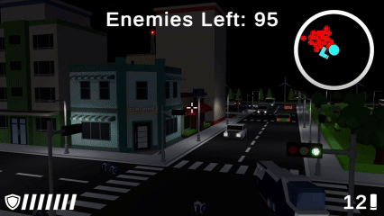
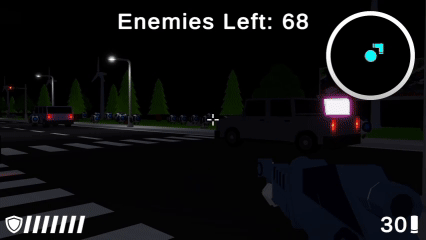

# Game Demo Collection

Two original games independently designed and developed with **Unity Engine** — from gameplay mechanics and scene layout to visual effects and combat systems.

---

## Minimum Dungeon

A 2D action-RPG dungeon crawler built around a tiered equipment system and escalating boss encounters. Players collect weapons with distinct attack styles, manage health potions, and level up through combat — all while adapting their strategy as a multi-phase boss shifts its behavior under pressure.

### Core Features

**Tiered Equipment System**
Weapons are divided into tiers, each with a unique attack style. Finding a higher-tier weapon meaningfully changes how combat feels and what strategies are open to the player.

**Health Potion Management**
Potions are a limited resource. Deciding when to use them — and when to save them for what comes next — is a constant tension throughout the run.

**Character Leveling**
Defeating enemies grants experience and levels up the character, providing a steady sense of growth that makes earlier challenges feel different as the run progresses.

**Multi-Phase Boss Combat**
The dungeon boss doesn't stay the same. As its health drops, its attack patterns shift — requiring players to read new behaviors and adapt on the fly rather than repeat a single winning approach.

### Gameplay Preview

---

## SharpShooter

A 3D first-person shooter set in a night city under alien siege. Players navigate dense urban environments, use terrain and stealth to outmaneuver intelligent mechanical enemies, and work toward a clear mission objective: destroy all alien portals to cut off reinforcements, then eliminate every remaining threat.

### Core Features

**Detailed 3D Night Environment**
A fully constructed urban setting with buildings, street infrastructure, and natural landscapes that shape movement and create tactical opportunities.

**Terrain & Stealth System**
Players can use cover and environmental geometry to avoid detection, reposition, or close in for a stealth takedown — rewarding patience as much as accuracy.

**Three-Weapon Arsenal**
Pistol, sniper rifle, and automatic rifle each suit a different range and situation. Ammo pickups are scattered through the environment, making resource awareness part of the challenge.

**Intelligent Enemy Behavior**
Mechanical aliens actively track the player rather than standing in place. Engagements feel dynamic because enemies respond and adapt to movement.

**Bullet Spark Effects**
Hit feedback is visual and immediate — spark effects on impact add to the weight of each shot and make the environment feel reactive.

**Clear Mission Objective**
Destroy all alien portals scattered across the map to stop enemy reinforcements, then clear out the remaining enemies. The structure gives players a goal to work toward beyond simple survival.

### Gameplay Preview

---

*All gameplay, level design, mechanics, and visual effects are independently created.*
